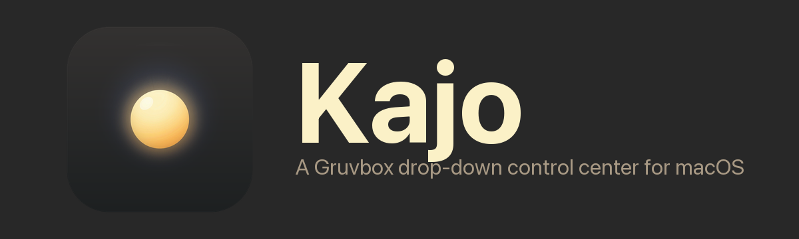
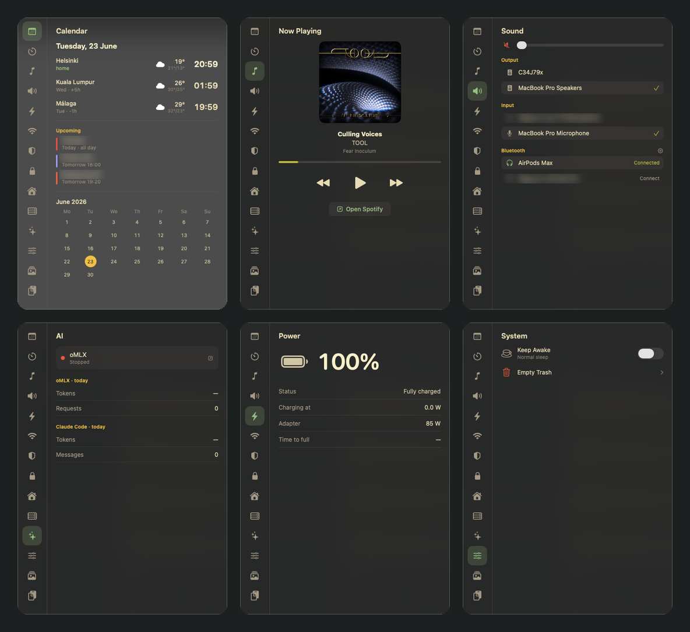
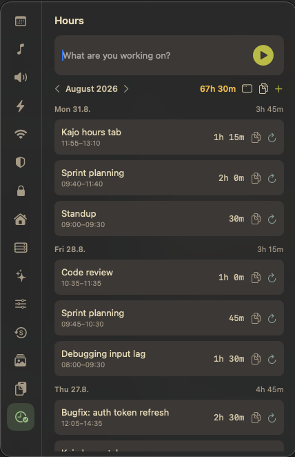
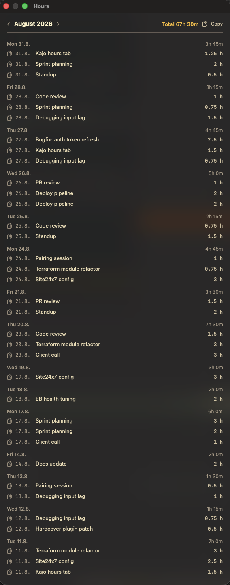

<p align="center">
  
</p>

> ⚠️ **100% vibe-coded — use at your own risk.** Built almost entirely by AI pair-programming (Claude Code). No warranty, no guarantees; it may misbehave or eat your config. Read the code before you run it.

A Noctalia-inspired drop-down control center for macOS: **one translucent, Gruvbox-themed window with everything on tabs**, summoned pre-switched to whichever tab you ask for. Pure `swiftc` + a Makefile — **no Xcode**. Runs as an `LSUIElement` agent (no dock icon).

16 tabs. Some work for anyone; some expect the author's home-lab and just show a "No config" hint until you point them at your own services:

- **Universal:** Calendar (world clocks + weather + events), Timer, Now Playing (Spotify), Sound (output/input + Bluetooth audio battery levels — AirPods L/R/case), Power, Network (Wi-Fi scan/join, service priority, copy-able local/public IP, and a speed test — built-in `networkQuality` or live-streaming Ookla `speedtest`), System (Keep Awake with optional timer + Empty Trash + a Settings button), Memes, Clipboard (with a URL tracking cleaner — strips tracking params + Echobox/xtor fragments, `kajo://clip/clean` — and send-to-Android via KDE Connect), Currency (configurable multi-currency converter via ECB rates, no API key), Hours (a stopwatch-plus-text work-hour tracker that logs entries per day, edits/resumes them, tags each with a **Severa project·phase** and **uploads a day at a time straight to Severa** — rounding up to the next 30 min, updating the existing row on re-upload — or one-click copies a chronological month list, with a floating always-on-top window to park beside the browser).
- **Needs your own backend (optional):** UniFi, Home (Home Assistant), Pi (a small health container), VPN, AI (a local oMLX server).

> ⚠️ It's a personal tool, not a polished product. It has a **built-in menu-bar icon** (plus `kajo://tab/<name>` URLs) to summon the panel, and reads optional per-module config from `~/.config/kajo/` — editable in a built-in **Settings window** (menu-bar → *Settings…*, the System tab's Settings button, or `kajo://config`) with typed forms *and* a raw-JSON view per file, or by hand (see `config-examples/`). Getting it running on a fresh Mac still means building it and sorting out code-signing — `./install.sh` (below) or the Claude Code prompt handles that.

## Screenshots

<p align="center">
  
</p>

<p align="center">
  
  &nbsp;&nbsp;
  
</p>
<p align="center"><sub>The <b>Hours</b> tab (left) and its floating, always-on-top window (right) for filling a monthly timesheet.</sub></p>

---

## 🟢 Install it with Claude Code (copy-paste this)

Open this folder in [Claude Code](https://claude.com/claude-code) and paste the prompt below. It tells Claude exactly how to build, sign, launch, and personalize Kajo on **your** Mac — adapting to what you have installed and which services you actually run.

````text
You're helping me install "Kajo", a SwiftUI/AppKit macOS menu-tool
that lives in this repo (Sources/*.swift — one file per tab plus Theme/Config/Panel/App
infra; built with swiftc via the Makefile —
no Xcode). It's the original author's personal control-center, so part of your job
is to make it work on MY Mac and strip out anything hardwired to them. Read
the Sources/*.swift files (start with main.swift + Panel.swift), the Makefile, and Info.plist first, then walk me through this,
asking me before anything that needs my input. Explain trade-offs; don't assume I
have the author's home-lab.

1. PREREQS — verify macOS 14+, that `xcode-select -p` works (Xcode Command Line
   Tools; offer to run `xcode-select --install` if not), and `make`. `blueutil`
   (via Homebrew) is optional, only for Bluetooth connect/disconnect in the Sound tab.

2. CODE SIGNING — the Makefile signs with a cert named "Kajo Self-Signed" that
   exists only in the AUTHOR's keychain. I don't have it, so pick one:
   (a) Recommended: create a fresh self-signed code-signing cert named exactly
       "Kajo Self-Signed" in MY login keychain (openssl → `security import` →
       `security add-trusted-cert -p codeSign`). This keeps macOS privacy
       permissions (TCC) granted across rebuilds.
   (b) Simpler: change the Makefile's SIGN_ID to ad-hoc signing ("-"). Works, but
       I'll have to re-approve permission prompts after each rebuild.
   Set it up, then `make install` (builds + copies to /Applications + registers
   the kajo:// URL scheme). Confirm /Applications/Kajo.app exists.

3. A WAY TO OPEN IT — the built-in menu-bar icon (▦) is on by default; beyond that the app is
   summoned via `kajo://tab/<name>` URLs. Ask me how I want to trigger it and set it
   up:
   - If I run [sketchybar](https://github.com/FelixKratz/SketchyBar): add click_scripts like `open 'kajo://tab/calendar'`.
   - Otherwise, offer me a choice and implement it: a global hotkey (skhd /
     Hammerspoon / Raycast / macOS Shortcuts), OR add a small NSStatusItem menu-bar
     button (in App.swift) that toggles the panel (good default for a normal
     user — implement it cleanly if I pick this).

4. PERSONALIZE — in Sources/Calendar.swift, replace the hardcoded `worldCities`
   (currently Helsinki / Kuala Lumpur / Málaga) with MY cities: name, IANA timezone,
   latitude, longitude (weather uses Open-Meteo, no API key). Also update the `home`
   timezone in WorldClocksView. Rebuild + reinstall.

5. CONFIGURE THE OPTIONAL TABS — all live in ~/.config/kajo/*.json (mode 600) and
   are skippable; an unconfigured tab just shows "No config". Ask which of these I
   actually use and set up only those:
   - UniFi  → unifi.json {host, username, password, site}  (local UniFi account)
   - Home   → ha.json {url, token, entities:[...]}          (Home Assistant)
   - Pi     → pi.json {local:"http://<my-pi-ip>:9099/health"}  (needs the
              kajo-health container running on my Pi — only if the author shared
              that folder too).
   - AI     → expects a local oMLX server at 127.0.0.1:8000.
   IMPORTANT: any `remote` / CloudFront / S3 / token values you see in examples or
   in a pi.json point at the AUTHOR's personal AWS account — DO NOT reuse them. Omit
   `remote` entirely unless I provision my own.

6. FIRST-RUN PERMISSIONS — tell me to approve the macOS prompts as I open tabs:
   Bluetooth, Location (for Wi-Fi scanning), Calendar (Upcoming events), and
   Automation/Spotify (Now Playing). The Network tab's "Wi-Fi priority" toggle needs
   a sudoers rule (/etc/sudoers.d/kajo-networksetup) — only add it if I want the
   silent toggle; otherwise leave it out.

7. OPTIONAL always-on — offer to create a LaunchAgent
   (~/Library/LaunchAgents/<id>.plist, RunAtLoad) pointing at
   /Applications/Kajo.app. Not required — opening a kajo:// URL launches it on demand.

8. VERIFY — open each universal tab (`open kajo://tab/calendar`, etc.), confirm the
   app stays alive, and tell me plainly which tabs are empty and why.
````

---

## Manual quickstart (if you'd rather not use Claude)

```sh
# 1. build (see signing note below) and install
make install
# …or let the installer handle prereqs + signing for you:
./install.sh                    # --self-signed for persistent TCC, --adhoc for simplest

# 2. summon a tab
open "kajo://tab/calendar"      # or music, sound, power, network, timer, system…

# 3. configure (optional) — GUI editor for ~/.config/kajo/*.json
open "kajo://config"            # or the menu-bar Settings… item
```

- **Signing:** the Makefile signs with `SIGN_ID := Kajo Self-Signed`. Create your own cert by that name, or set `SIGN_ID := -` for ad-hoc signing.
- **Open it:** wire `open 'kajo://tab/<name>'` to a hotkey, a [sketchybar](https://github.com/FelixKratz/SketchyBar) item, or add a menu-bar button. Re-firing the same tab toggles it closed; click outside or press `Esc` to dismiss.
- **Personalize:** edit `worldCities` and the home timezone in `Sources/Calendar.swift`.
- **Optional configs:** `~/.config/kajo/{unifi,ha,pi}.json` (mode 600). Absent = that tab shows "No config".

## Status

v0.26 — hardening pass after a full code review (no new features, everything still works the same). **Hours/Severa:** days are bucketed in the timesheet's timezone (`severa.json` `"timeZone"`, default Europe/Helsinki) instead of the Mac's, so travelling can't re-key uploaded days and duplicate rows; `hours.json` is written atomically + `0600` and an unreadable log is set aside as `hours.json.corrupt-…` instead of being silently overwritten; upload records moved from UserDefaults to `hours-uploads.json` next to the log (auto-migrated); a 401 drops the cached token and retries once; failures show the HTTP code + body; entries whose phase has no work type now count as unassigned; a ⚠ marks days whose uploaded row no longer matches the log (Kajo **never deletes or edits rows it didn't create** — fix those in Severa, then "Forget"); the Severa model is app-lifetime (no refetch per tab visit); + then Cancel no longer leaves a 1 h ghost entry. **Elsewhere:** Home Assistant validates TLS normally (Let's Encrypt); UniFi trusts its self-signed cert only for the configured host and re-logs-in only on 401; clipboard history + "→ vim" hand-off files are owner-only and the temp file is deleted after nvim reads it; config typos (Pi `remote`, Calendar `tz`) no longer crash-loop; pollers have in-flight guards; countdown timer is wall-clock based (sleep-safe); meme thumbnails are cached + decoded off-main; `kajo://config` works; `make install` replaces the bundle whole and relaunches; `make check` runs the headless self-check; swiftc gets an explicit `-target …-macos14.0`; one shared `shell()` / `loadConfigJSON()` / `writePrivate()` / `hint()` instead of five copies.

v0.25 — 16 working tabs, quake-style slide animation, code-signed (TCC persists), UniFi/Network/Pi cached for instant open. New: **Severa integration** in the Hours tab (`Severa.swift`) — tag entries with a **project·phase** picked from your own recent Severa hours (the only user-scoped filter the API honors), then **upload a day at a time** with a per-day ⬆ button: each day is aggregated into day×phase×workType buckets, rounded **up to the next 30 min**, and POSTed to Severa; re-uploading **PATCHes the existing row** instead of duplicating (buckets tracked by workhour guid). Config in `~/.config/kajo/severa.json` (off-repo). Earlier: the **Hours** tab itself (`Hours.swift`) — stopwatch-plus-text tracker with an editable per-day log, month navigation, one-click **copy-month** for a timesheet, and a floating always-on-top window. Earlier: a **Settings window** (`ConfigWindow.swift` — translucent, per-file typed forms ⇄ raw JSON, templates, validity check, Relaunch), the System tab's **Keep Awake timer** (15m–4h presets with live countdown), Currency is now **config-driven** (`currency.json`), and an **`install.sh`** that automates prereqs + signing. Source split per-tab across `Sources/*.swift` (main.swift = bootstrap only).
